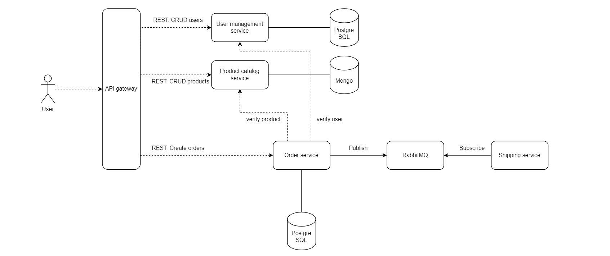

# Cloud Services

## Goals of this Services
Gain practical hand-on with 
 - microservices
 - REST APIs, Message Brokers
 - Docker, Docker Compose, Kubernetes
 - Databases (PostgreSQL, MongoDB)
 - Infrastructure as Code (Pulumi)
 - Github Actions
 - Microsoft Azure

---

--

## Services description
- Developing 4 microservice with REST APIs:
    - User service
    - Product catalog service
    - Order service
    - Shipping service
- Docker compose file to locally start a PostgreSQL and MongoDB server
- Persist user service data and order service data to PostgreSQL
- Persist product catalog service data to Mongo DB
- Add service to service communication from order service to user service and product catalog service
- Extend Docker compose file to deploy all databases and services at once
- Extend Docker compose file so that RabbitMQ server is started
- Add asynchronous service to service communication from order service to shipping service
